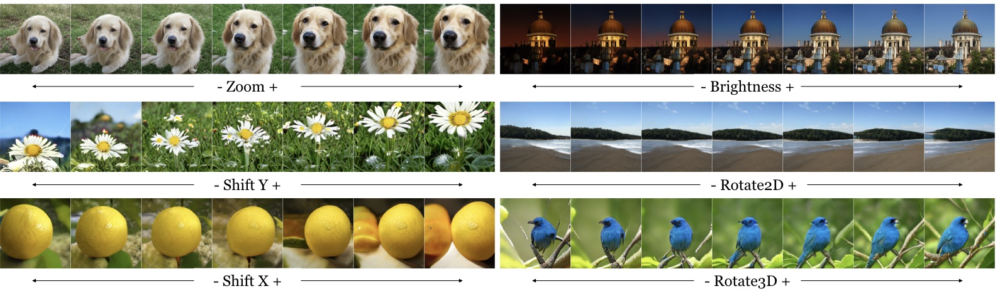
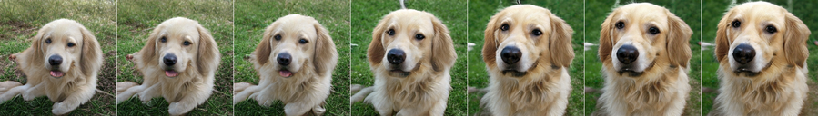
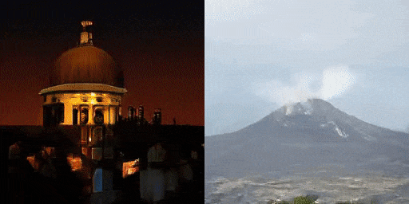
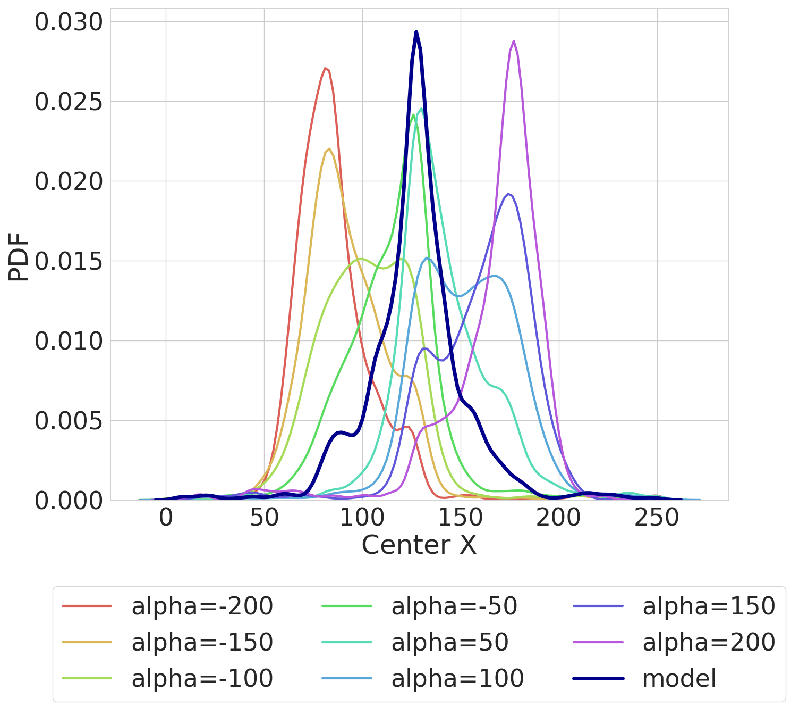

# GAN steerability
[Project Page](https://ali-design.github.io/gan_steerability/) |  [Paper](https://arxiv.org/abs/1907.07171) 

  

On the "steerability" of generative adversarial networks.\
[Ali Jahanian](http://people.csail.mit.edu/jahanian)\*, [Lucy Chai](http://people.csail.mit.edu/lrchai/)\*, [Phillip Isola](http://web.mit.edu/phillipi/)

## Prerequisites
- Linux
- Python 3
- CPU or NVIDIA GPU + CUDA CuDNN

**Table of Contents:**<br>
1. [Setup](#setup)<br>
2. [Visualizations](#visualizations) - plotting image panels, videos, and distributions<br>
3. [Training](#training) - pipeline for training your own walks<br>
4. [Notebooks](#notebooks) - some jupyter notebooks, good place to start for trying your own transformations<br>
5. [PyTorch](#pytorch) - pytorch implementation in a colab notebook<br>

<a name="setup"/>

## Setup

- Clone this repo:
```bash
git clone https://github.com/ali-design/gan_steerability.git
```

- Install dependencies:
	- we provide a Conda `environment.yml` file listing the dependencies. You can create a Conda environment with the dependencies using:
```bash
conda env create -f environment.yml
```

- Download resources:
	- we provide a script for downloading associated resources (e.g. stylegan). Fetch these by running:
```bash
bash resources/download_resources.sh
```

<a name="visualizations"/>

## Visualizations

**Plotting image panels:**
<br>


- Run `python vis_image.py -h` to list available visualization options. The key things to provide are a model checkpoint and a config yml file. We added some pretrained weights in the `./models_pretrained`, but you can also use the models you train yourself.

```bash
python vis_image.py \
	models_pretrained/biggan_zoom_linear_lr0.0001_l2/model_20000_final.ckpt \
	models_pretrained/biggan_zoom_linear_lr0.0001_l2/opt.yml \
	--gpu 0 --num_samples 50 --noise_seed 20 --truncation 0.5 --category 207

python vis_image.py \
        models_pretrained/stylegan_color_linear_lr0.0001_l2_cats_w/model_2000_final.ckpt \
        models_pretrained/stylegan_color_linear_lr0.0001_l2_cats_w/opt.yml \
        --gpu 1 --num_samples 10 --noise_seed 20 
```

- By default this will save generated images to `<output_dir>/images` specified in the config yml, unless overwritten with the `--output_dir` option

<br>

**To make a videos:**
<br>


```bash
python vis_video.py [CHECKPOINT] [CONFIG] --gpu [GPU] --noise_seed [SEED] --sample [SAMPLE]

python vis_video.py models_pretrained/biggan_color_linear_lr0.001_l2/model_20000_final.ckpt \
	models_pretrained/biggan_color_linear_lr0.001_l2/opt.yml  --gpu 0 --sample 10 \
	--noise_seed 20 --truncation 0.5 --category 538 --min_alpha -1 --max_alpha 0
```

- By default this will save output to `<output_dir>/video` specified in the config yml, unless overwritten with the `--output_dir` and `--filename` options
<br>

**To draw distributions:**
<br>


To draw distributions, you will need to have downloaded the object detector through `resources/download_resources.sh` (for objects) or installed dlib through `environment.yml` (for faces). 
```bash
python vis_distribution.py [CHECKPOINT] [CONFIG] --gpu [GPU]

python vis_distribution.py models_pretrained/biggan_shiftx_linear_lr0.001_l2/model_20000_final.ckpt \
	models_pretrained/biggan_shiftx_linear_lr0.001_l2/opt.yml  --gpu 0
```
- By default this will save output to `<output_dir>/distribution` specified in the config yml, unless overwritten with the `--output_dir` option

<a name="training"/>

## Training walks
- The current implementation covers these variants:
	- models: biggan, stylegan, pgan
	- transforms: color, colorlab, shiftx, shifty, zoom, rotate2d, rotate3d
	- walk_type: linear, NNz
	- losses: l2, lpips
- Some examples of commands for training walks:
```bash
# train a biggan NN walk for shiftx with lpips loss
python train.py --model biggan --transform shiftx --num_samples 20000 --learning_rate 0.0001 \
	--walk_type NNz --loss lpips --gpu 0 --eps 25 --num_steps 5

# train a stylegan linear walk with l2 loss using the w latent space
python train.py --model stylegan --transform color --num_samples 2000 --learning_rate 0.0001 \
	--walk_type linear --loss l2 --gpu 0 --latent w --model_save_freq 100

# train a pgan linear walk with l2 loss
python train.py --model pgan --transform color --num_samples 60000 --learning_rate 0.0001 \
	--walk_type linear --loss l2 --gpu 0 --dset celebahq --model_save_freq 1000
```
- Currently for pgan we only support the celebahq dataset, but you can easily train walks using other pretrained models by downloading the weights to `resources/pgan_pretrained` and adding the model information to `graphs/pgan/constants.py`

- Alternatively you can train using a config yml file, for example:
```bash
python train.py --config_file config/biggan_color_linear.yml
```

- Each training run will save a config file called `opt.yml` in the same directory as the weights, which can be used for rerunning experiments with the same settings. You may need to use the flag `--overwrite_config` for overwriting existing weights and config files. 

- Run `python train.py -h` to list available training options
- You can use these walks that you train yourself for the above visualizations, by specifying the path to the corresponding model checkpoint and `opt.yml` config file.

<a name="notebooks"/>

## Notebooks

- We provide some examples of jupyter notebooks illustrating the full training pipeline. See [notebooks](./notebooks).
- It might be easiest to start here if you want to try your own transformations! The key things to modify are `get_target_np` and to scale alpha appropriately when feeding to graph.
- If using the provided conda environment, you'll need to add it to the jupyter kernel:
```bash
source activate gan_steerability
python -m ipykernel install --user --name gan_steerability
```

<a name="pytorch"/>

## PyTorch

- You can find a google colab notebook with pytorch implementation on BigGAN [here](https://colab.research.google.com/drive/1WRcCnYX_fjN3hp5-DXhGquXHs44hgVV6)

### Citation
If you use this code for your research, please cite our paper:
```
@article{gansteerability,
  title={On the "steerability" of generative adversarial networks},
  author={Jahanian, Ali and Chai, Lucy and Isola, Phillip},
  journal={arXiv preprint arXiv:1907.07171},
  year={2019}
}
```


